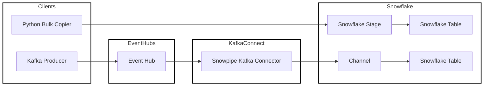

# Snowflake Demo

This repository demonstrates loading data into snowflake using the bulk copy method and Snowpipe Streaming, using Azure Event Hubs as a remote Kafka service.

- [Introduction](#introduction)
- [Running the Demo](#running-the-demo)
- [Local Development](#local-development)

## Introduction

The project uses the faker library to generates two data models, `order` and `customer`. Customer data is [bulk loaded](https://docs.snowflake.com/en/user-guide/data-load-overview#bulk-loading-using-the-copy-command), Order data is streamed via using [snowpipe streaming](https://docs.snowflake.com/en/user-guide/data-load-snowpipe-streaming-overview). There is also a `kafka-consumer` services which consumes the order kafka stream and prints the data to stdout, but doesn't communicate with Snowflake.



Note, that the NodeJS Kafka client is unfortunately closely tied to the EventHubs version of Kafka, which doesn't support the full protocol. Bespoked testing revealed that `commit` is a no-op, and there one has to use the Kafka `seek` request to manually increment the position of the consumer in the stream. This was not a performant operation, and therefore it is not recommended to use this client in production. It is unclear whether EventHubs is suitable for high throughput data streams, however, there are plenty of alternatives if one needs managed Kafka on the cloud, such as [Confluent](https://www.confluent.io/), [AutoMQ](https://github.com/AutoMQ/automq), and [Canonical Azure Managed Kafka](https://azuremarketplace.microsoft.com/en-us/marketplace/consulting-services/canonical.0001-com-ubuntu-managed-kafka).

## Running the Demo

To run this project you will need an Azure and Snowflake Account, and network access to both. Credentials for these services are injected into containerised services using environment variables.

### Setup Snowflake

Sign up for Snowflake or use an existing account at the [Snowflake website](https://www.snowflake.com/en/).

This app authenticates with Snowflake using a public-private key pair. Information on setting up a key pair can be found in the [Snowflake documentation](https://docs.snowflake.com/en/user-guide/key-pair-auth).

The login process will need an account identifier and a username. The Snowflake account identifier can be exposed using the [CURENT_ACCOUNT](https://docs.snowflake.com/en/sql-reference/functions/current_account) command, and if running on a private Snowflake account, the [CURRENT_USER](https://docs.snowflake.com/en/sql-reference/functions/current_user) command might be useful, too for getting a user identifer.

Once you have access to these identifiers you will need to export them to the shell environment.

- `SNOWFLAKE_ACCOUNT`
- `SNOWFLAKE_USER`
- `SNOWFLAKE_PRIVATE_KEY`

Note, that `SNOWFLAKE_PRIVATE_KEY` should contain no prefix or suffix strings. This command might be useful for extracting just the key value, assuming you've stored the key in at `~/.ssh/rsa_key.p8`

```shell
openssl rsa -in ~/.ssh/rsa_key.p8 -outform DER 2>/dev/null  | base64 -w 0
```

### Setup Azure

Sign up for Azure or use an existing account at the [Azure website](https://azure.microsoft.com/en-au).

After you have an account, install the Azure cli for your operating system by following the [official instructions](https://learn.microsoft.com/en-us/cli/azure/install-azure-cli?view=azure-cli-latest).

Setup the cli for running the project using the command `source cli_setup.sh`. This will prompt you to login and set a default location for your subscription. All cloud infra for this project will be deployed into that location. If you have not already done so, the setup script will register your subscription with the Microsoft storage provider. This step is required in order to create the Terraform remote state, which in turn will create the Azure infrastructure required to run the demo.

### Create Azure Infrastructure

Install the `terraform` cli if you have not already done so using the [official instructions](https://developer.hashicorp.com/terraform/tutorials/aws-get-started/install-cli). See [Local Development](#local-development) section for information on using `asdf` to manage runtime versions.

Navigate to the "terraform/" folder and run `source remote_state_setup.sh`. This will create a remote state file on Azure for tracking your Azure resources. This script will also write some account identifiers and required config (such as the name of the EventHub a.k.a. the kafk topic) to "terraform/terraform.tfvars". This file is not included in version control.

Once this script exits run `terraform apply`, answer "y" at the prompt. This will create your Azure infrastructure.

Terraform will capture two sensitive values that you will need to save for later use. You can expose them using the `terraform output -json` command. Save them in the following variables.

- `PRIMARY_CONNECTION_STRING`
- `BOOTSTRAP_SERVER`

### Run the Demo

The demo will run in docker using the command `docker compose up`. The logs can be inspected using `docker compose logs <service_name>`.

All additional configurables are contained in the ".env" file. Please refer to that file for a description of the configuration.

If you have forgotten to inject the secrets into your shell prior to running the demo, then rerunning `docker compose up` will not detect any secrets added retroactively. You will need to bring the stack down before bringing it up again. This command takes a slightly scorched approach to restarting docker but will definitely add the newly minted secrets to the relevant containers

```shell
docker compose down && docker system prune -f && docker volume prune -af && docker compose up
```

## Local Development

Local development required access to nodejs, python and terraform binaries. We suggest you use `asdf` for version control, though this is not compulsory. Refer to the instructions in each of the individual folders for further instructions.

Most apps will require environment varialbes for their config. You can add the definition in the ".env" file to your shell session using the command `export $(grep -v '^#' .env | xargs)`.
